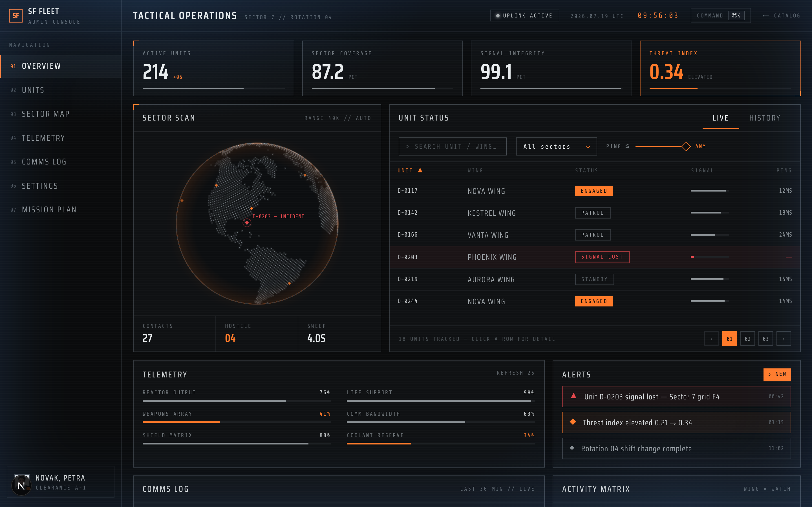
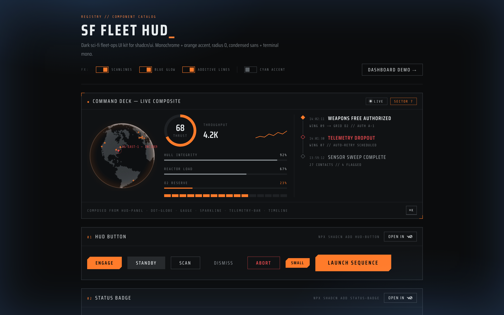
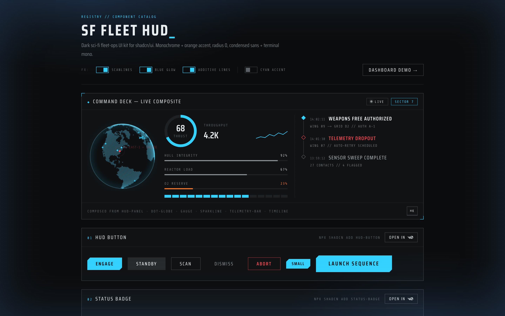
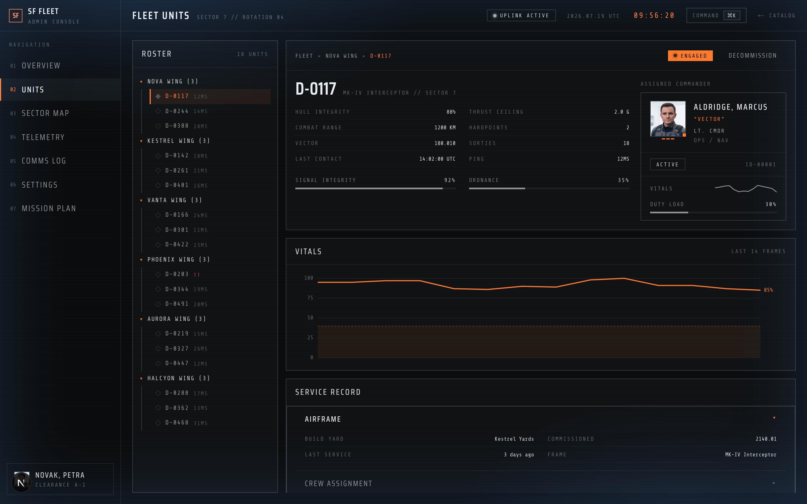
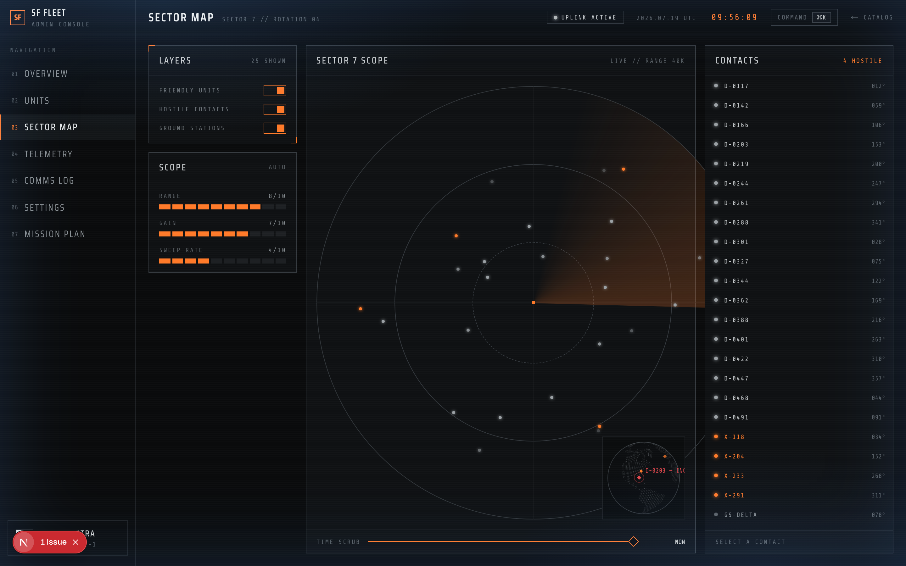
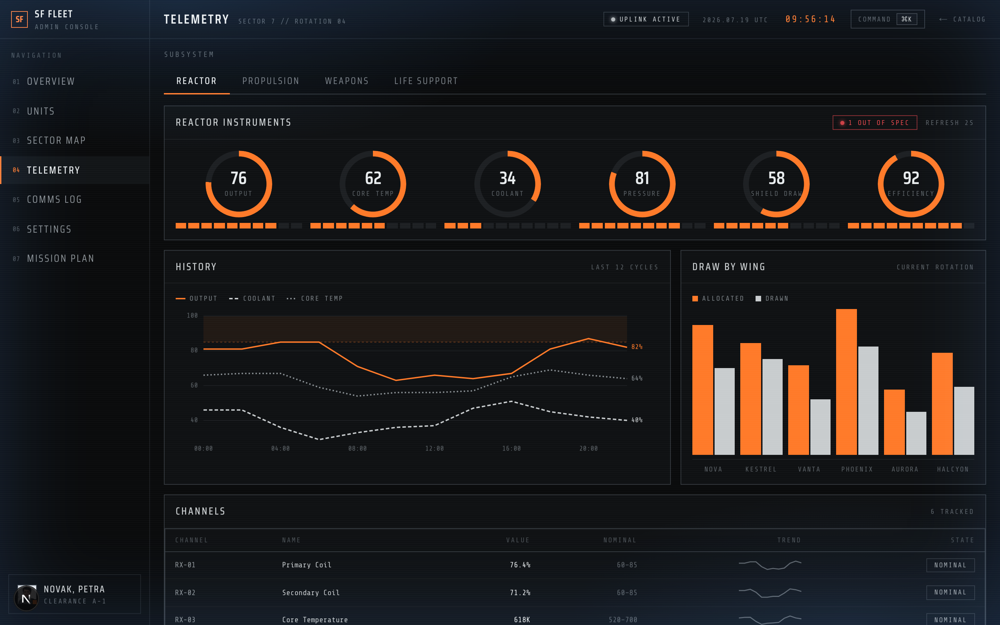
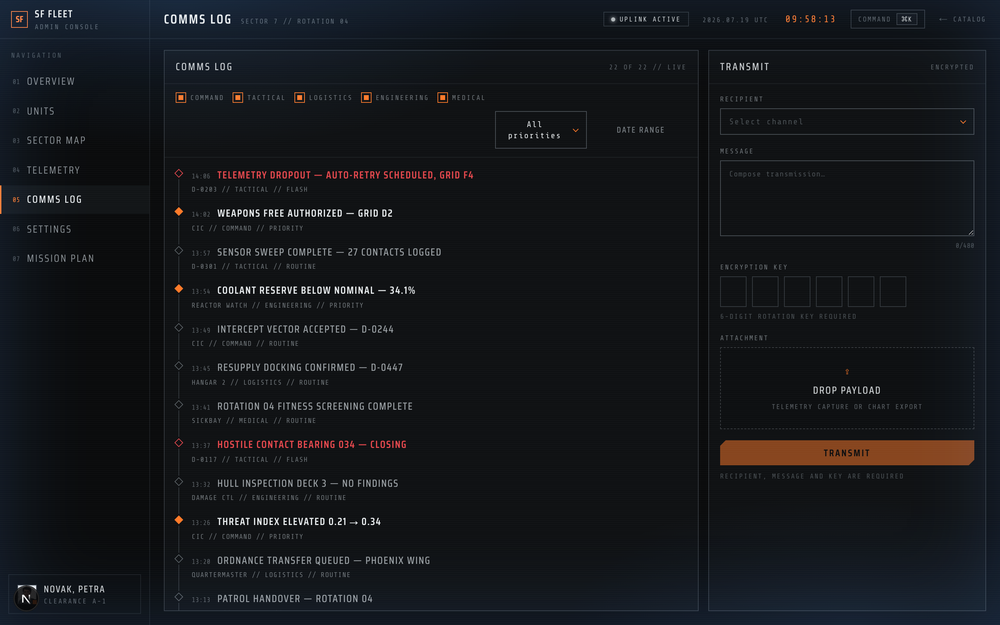

# SF Fleet HUD

A dark sci-fi fleet-ops UI kit for [shadcn/ui](https://ui.shadcn.com), distributed as a custom registry. Monochrome + orange accent, radius 0, condensed sans + terminal mono. **47 registry items**: a full set of restyled primitives plus HUD widgets you won't find in a stock kit.

**Live demo:** [sf-fleet-hud.vercel.app](https://sf-fleet-hud.vercel.app) · **Dashboard sample:** [/dashboard](https://sf-fleet-hud.vercel.app/dashboard)



## Quick start

```bash
# 1. Theme (fonts, tokens, radius 0)
npx shadcn@latest add https://sf-fleet-hud.vercel.app/r/theme-hud.json

# 2. Any component
npx shadcn@latest add https://sf-fleet-hud.vercel.app/r/hud-button.json
npx shadcn@latest add https://sf-fleet-hud.vercel.app/r/dot-globe.json
```

Load the fonts in your app (Google Fonts, OFL-licensed): **Saira Condensed** (300–700) as `--font-sans` and **Share Tech Mono** as `--font-mono`. With Next.js, use `next/font/google` and map the variables in your CSS — see [app/layout.tsx](app/layout.tsx) and [app/globals.css](app/globals.css).

> The theme is **dark-only by design**. Radius is 0 everywhere. The minimum font size is 10px.

### Cyan accent variant

Warnings and destructive tones stay warm; everything accent-driven switches to cyan:

```bash
npx shadcn@latest add https://sf-fleet-hud.vercel.app/r/theme-hud-cyan.json
```

| Amber (default) | Cyan |
| --- | --- |
|  |  |

## What's inside

**Restyled primitives** — button, label, input, textarea (live character counter), switch, checkbox, radio-group, select, tabs, alert, dialog, sheet, tooltip, sonner toaster, context-menu, command palette (cmdk), table, pagination, chip, accordion, breadcrumb, avatar, slider, popover, input-otp, calendar.

**HUD widgets** — panel (corner brackets), status-badge, telemetry-bar, segment-bar, kbd, skeleton, gauge, sparkline, heatmap, timeline, tree, dropzone, stepper, typography scale (H1–H6 + body), crew-card, radar, and **dot-globe**.

**Charts** — line-chart and bar-chart, drawn as plain SVG with **no charting dependency**. The line chart does multi-series with axis grid, a caution band, direct end-labels and a hover crosshair readout.

```tsx
<HudLineChart
  height={210}
  unit="%"
  labels={cycles}
  band={{ from: 85, to: 100 }}
  series={[
    { name: "Output", values: output },
    { name: "Coolant", values: coolant },
  ]}
/>
```

Series are separated by **lightness plus a dash pattern**, not by hue — this kit is monochrome by design, so colour alone would not distinguish them. The four steps are validated for colour-vision deficiency (ΔE 16.4 on adjacent pairs); the red `--chart-5` token is deliberately reserved for status and never used as a series. Past four series, facet instead of inventing a fifth hue.

### Dot Globe

An interactive dotted earth (canvas, zero runtime deps): drag to rotate with inertia, wheel to zoom, optional edge/dot glow. Pass `markers` to plot real locations — an `incident` marker gets a pulse ring and label, ready for region-outage UIs:

```tsx
<DotGlobe
  size={340}
  edgeGlow
  dotGlow
  markers={[
    { code: "us-east-1", lat: 38.9, lon: -77.4, status: "incident" },
    { code: "eu-central-1", lat: 50.1, lon: 8.7 },
  ]}
/>
```

Land dots are precomputed from Natural Earth data (public domain) and embedded — no fetches, no assets. The radar accepts polar `blips` (`{ angle, distance, hot }`) the same way.

All decorative motion respects `prefers-reduced-motion`.

## Dashboard demo

[/dashboard](https://sf-fleet-hud.vercel.app/dashboard) is a seven-screen ops console built entirely from the kit. Every component in the kit earns its place in a working screen — none is left as a swatch. The Overview is pictured at the top; the rest:

| | |
| --- | --- |
| **Units** — wing tree, spec sheet, right-click orders, decommission dialog | **Sector Map** — radar scope with clickable contacts, layer toggles, time scrub |
|  |  |
| **Telemetry** — gauge bank, history chart, per-wing draw, channel table | **Comms Log** — filterable timeline plus an OTP-gated compose form |
|  |  |

Plus **Settings**, where the accent radio live-swaps the theme tokens, and **Mission Plan**, a four-step stepper wizard that gates each step until its inputs are valid.

The screens live under [app/dashboard/](app/dashboard) with their components in [components/dashboard/](components/dashboard). They are **demo code, not registry items** — fixtures and layout are yours to write; the kit supplies the parts.

## Registry

The full catalog with copyable install commands lives at [sf-fleet-hud.vercel.app](https://sf-fleet-hud.vercel.app). Every item is served from `/r/<name>.json`; cross-component dependencies resolve automatically.

Two notes on what installing does and does not bring:

- **`crew-card`** composes `hud-avatar` + `status-badge` + `telemetry-bar` + `hud-sparkline`, and those install with it. Portraits do not — registry files are JSON text, so binaries cannot ship through it. Pass your own image to the `photo` prop; without one the card falls back to initials.
- **Fonts** are not installed either. Load Saira Condensed and Share Tech Mono yourself (see Quick start).

## Development

```bash
pnpm install
pnpm dev              # demo catalog
pnpm registry:build   # emit public/r/*.json
```

After cloning, enable the commit guard once: `git config core.hooksPath .githooks`.

## License

MIT. Fonts are served via Google Fonts under the SIL Open Font License. Globe land-dot data derived from [Natural Earth](https://www.naturalearthdata.com/) (public domain).
